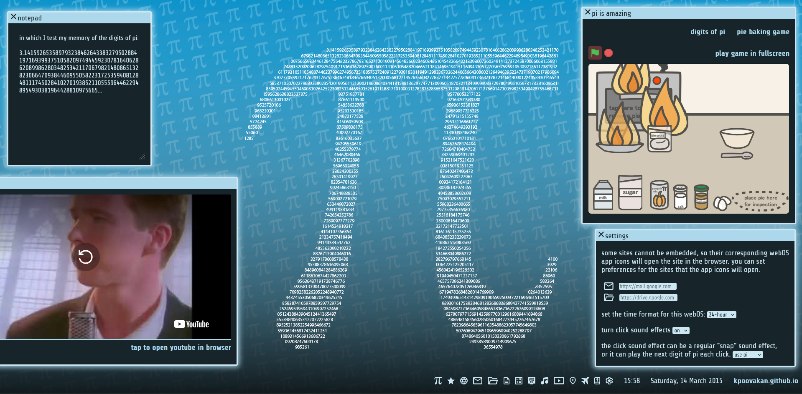

# pi webOS
  
A pi-themed "operating system" that "runs" in your browser. This was created for a summer program challenge which the developer participated in.

## Features
* Fourteen different "apps"! See [apps](#apps) for details.
* Date and time, with options to change preferred time format.
* Quick access to [kpoovakan.github.io](https://kpoovakan.github.io) for other awesome tools.
* An amazing blue background with the digits of pi.

## Setup
  
Since this "operating system" runs on web browsers, there is no installation needed! Simply open this webOS in your browser [here](https://kpoovakan.github.io/piwebos).

## Apps
| App Name | App Icon | App Features | Opens In... |
| :------: | :------: | :----------- | :-----------: |
| Pi Is Amazing | Pi Symbol | View the first 314 digits of pi, or play my silly little pi(e) game. | WebOS |
| Kpoovakan | Star | Access links to my website and profile, or try four featured games. | WebOS |
| Web | Web Globe | Search the web through [Stickytab](https://kpoovakan.github.io/stickytab). | Browser |
| eMail | Envelope | Open [Gmail](https://mail.google.com) or any eMail service of your choice. Customize in the settings app. | Browser |
| File Manager | File Folder | Open [Google Drive](https://drive.google.com) or any cloud file manager of your choice. Customize in the settings app. | Browser |
| Notepad | Paper With Notes | Simple text editor, saved to local browser storage. | WebOS |
| Calculator | Math Symbols | Use a scientific calculator. Powered by [Desmos](https://desmos.com). | WebOS |
| Turbowarp | Turbowarp Logo | Opens the [Turbowarp editor](https://turbowarp.org/editor). | Browser |
| Music | Music Note | View my [ChopinEtudes](https://kpoovakan.github.io/chopinetudes) project. Isn't classical music always associated with math? | WebOS |
| YouTube | Video | Opens YouTube. | WebOS |
| Maps | Location Marker | View Kansas (and any other place of your choice). Powered by [Google Maps](https://maps.google.com). | WebOS |
| Flight Tracker | Airplane | Opens [Flight Tracker](https://map.opensky-network.org). | Browser |
| Bible | Bible | Opens an online Bible. | Browser |
| Settings | Settings Gear | Edit settings for the webOS. | WebOS |

## Credits
* This webOS was created by [kpoovakan](https://kpoovakan.github.io).
* It is unknown who created the amazing pi background. Numerous internet searches do not provide or confirm any sources or artists.
* The main font is [Share Tech](https://github.com/google/fonts/tree/main/ofl/sharetech) by [Carrois Apostrophe](http://www.carrois.com/).
* All app icons were created by [kpoovakan](https://kpoovakan.github.io) or [Google](https://github.com/google/material-design-icons?tab=readme-ov-file). We are not affiliated with or endorsed by Google.